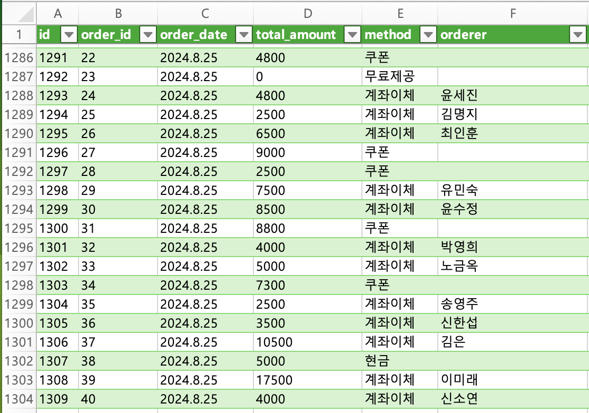
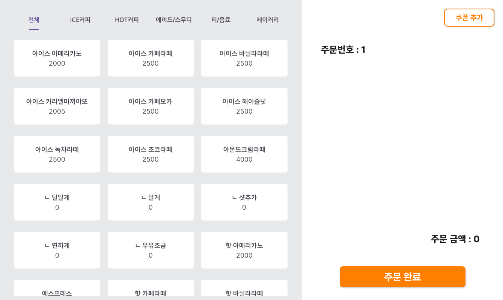
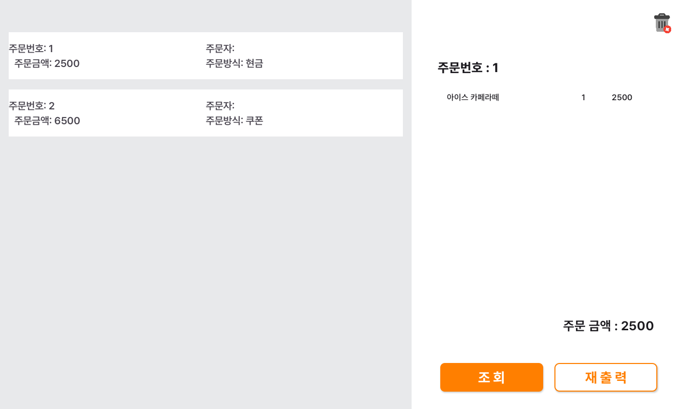
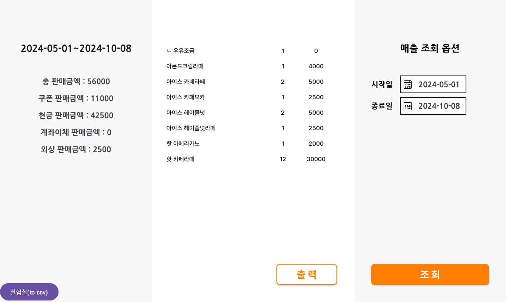
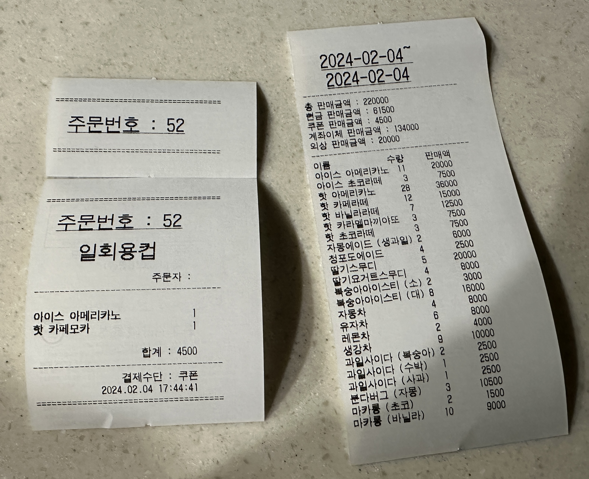

## 1. 프로젝트 개요

강원도 원주시 소재의 이룸교회의 카페에서 사용중인 Customized 안드로이드 POS 시스템입니다.

Bluetooth 연결을 통한 ESC/POS 명령 타입의 영수증 프린터를 지원합니다.

### 사용중인 하드웨어

- Galaxy Tab A7 lite (8.7”) with Android 14
- SEWOO SLK-TS400 Bluetooth ESC/POS printer

## 2. 기획 의도

카드 결제를 사용하지 않는 카페로써 **상용 POS 시스템이 필요하지 않았습니다**.

명확한 시스템이 존재하지 않았으므로 **주문지를 종이로 프린트하여서 수기로 주문을 작성**하였고,

이를 카페를 관리하시는 분이 **엑셀로 직접 옮겨서 작성**하는 불필요한 수고가 존재하였습니다.

따라서 **Android 기반의 POS 시스템 프로젝트를 시작**하였습니다.

### Why Kotlin-Android?

카페의 카운터 공간이 협소하여, 일반적인 데스크탑 또는 PC는 적합하지 않습니다.

타겟 디바이스는 태블릿을 선택하였으며 JAVA에 대한 지식을 기반으로 Kotlin 과 Android를 학습하여 개발하기로 결정했습니다.

## 3. 주요 기능

- 주문받기
- 블루투스를 이용한 영수증 출력 (ESC/POS)
- 오늘 저장된 주문 목록 조회 및 상세 조회
- 지정한 기간에 대한 매출 현황 보고서 조회 및 출력

## 4. 프로젝트 사진



2024.2.4 ~ 2024.8.25 동안 앱으로 주문된 건수 : 1304건



판매자 시점 UI



오늘의 주문 목록 조회 UI



매출 조회 UI (약 3개월 매출현황)


메뉴 관리 UI



실제 출력된 영수증의 사진

## 5. 느낀점

관련 지식(Kotlin, Android, SQL)이 전무한 상태로 개발을 시작하였습니다.

프로젝트를 진행하면서 실제 생활 속 문제를 해결하는 좋은 경험이 되었으며,

프로젝트를 수행하면서 필요한 지식을 학습하는 과정들이 큰 도전이 되었고, 크게 성장한 것 같아 기쁩니다.

특히 개념으로만 알고있던 객체지향적 프로그래밍을 적용하는 좋은 기회가 되었습니다.

기술적인 느낀점은 하단의 **6. 프로젝트 유지 보수 기록**에 서술하였습니다.

## 6. 프로젝트 유지 보수 기록

| **버전** | **내용** |
| --- | --- |
| **1.0.0** | **베타 테스팅 시작 (24.01.28)** |
| **1.1.0** | **기능 추가 (24.02.02)**<br/>1. 외상 구매에 관한 처리기능<br/>2. 판매 리포트 조회 및 출력<br/>3. 주문 옵션 추가(일회용컵/머그컵 옵션)<br/>4. 안드로이드 전체화면 적용 |
| **1.2.0** | **기능 추가 (24.02.21)**<br/>1. 주문 내역 삭제 기능 |
| **1.2.1** | **마이너 업데이트 (24.02.24)**<br/>1. 매출보고서 영수증 출력 로직 수정<br/>2. 판매 리포트 창 수정 |
| **1.2.2** | **마이너 업데이트 (24.03.02)**<br/>1. 메뉴 목록을 .csv 저장형식으로 변경하여 편리한 수정방법 적용<br/>2. 쿠폰과 할인 옵션에 대한 탭 추가 (1.3.0 에서 삭제) |
| **1.3.0** | **기능 추가 (24.03.13)**<br/>1. 주문 시 복수 결제옵션 선택 기능 추가<br/>2. 데이터 베이스 기능 수정<br/>3. 쿠폰 추가 버튼 적용<br/>4. menu.csv에 진열 순서에 대한 정보를 추가하고 메뉴 정렬옵션 추가 |
| **1.3.1** | **데이터베이스 관련 로직 최적화 (24.05.01)**<br/>SQL query 수정으로 프로그램 최적화 |
| **1.3.2** | **기능 추가 (24.06.07)**<br/>1. APP 실행 시 전체화면 모드 (몰입 모드) 실행 |
| **1.4.0** | **코드 리팩토링 및 DB 개선 (24.08.29)**<br/>[https://velog.io/@siku-kr/Holybean-리팩토링-및-DB-개선-기록-v1.4.0](https://velog.io/@siku-kr/Holybean-%EB%A6%AC%ED%8C%A9%ED%86%A0%EB%A7%81-%EB%B0%8F-DB-%EA%B0%9C%EC%84%A0-%EA%B8%B0%EB%A1%9D-v1.4.0) |
| **1.4.1** | **버그 수정 (24.09.02)**<br/>1. Database 자료형 오류로 생긴 버그(주문번호가 10이상 안올라가는) 수정 |
| **1.4.2** | **버그 수정 및 데이터베이스 개선 (24.09.23)**<br/>1. 메뉴 카테고리 적용안되는 버그 수정<br/>2. Database에 UUID 적용하여 중복 데이터 행 제거 |
| **1.5.0** | **기능 추가 (24.10.01)**<br/>1. 메뉴 관리 서비스 추가 |


### v 1.2.2 : 메뉴 목록을 .csv 저장형식으로 변경하여 편리한 수정방법 적용

기존 데이터베이스 구조에는 **정보 저장 목적의 메뉴 테이블이 포함**되어 있었는데, 

카페 운영 시 **메뉴 수정으로 인해 데이터베이스 업데이트가 잦았습니다**.

**데이터베이스를 업데이트 하는 행위는 기록의 일관성을 방해하는 행위**가 되었습니다.

이때 데이터베이스를 query로 업데이트하는 방식이 개발되지 않았기에 임시 방편으로써,

**메뉴를 별도의 CSV 형식 파일로 관리하는 방법을 적용**하였습니다.

이 과정에서 메뉴 관리 기능 및 데이터베이스 서버화의 필요성을 느꼈습니다.

> 2024.7.2.
실 사용 장소 내부에 wifi 설치 불가능으로 인해 서버화는 불가능 함을 판단하였습니다. ㅠㅠ
> 

### v 1.3.0 menu.csv에 진열 순서에 대한 정보를 추가

기존에는 오름차순으로 개발자가 등록한 `menu id`에 따른 정렬 방식으로 디스플레이에 전시 하였는데,

이는 **메뉴의 관리 및 등록 과정에서 상당한 불편함을 초래**하였고, 

menu.csv 파일 내부에 진열 순서에 대한 정보를 포함시킴으로써 문제를 해결하였습니다.

### v 1.3.1 SQL Query 수정으로 프로그램 최적화

이 update는 **2024년 데이터베이스 수업**을 듣고 기획되었습니다.

초기 프로그램은 Query에 대해 지식이 없는 상태로 작성되어서, 매우 기본적인 쿼리문만 사용되었습니다.

이로 인해서 **정렬, 필터링과 같은 연산이 부수적으로 존재**하였고 조금 더 복잡한 쿼리를 사용하여 해결하였습니다.

**체감상 미세한 성능 개선과 코드 가독성 향상 효과**가 있었습니다.

- ORDER BY 사용을 통한 개선 : sort 메소드 제거
    
    before :
    
    ```kotlin
    val cursor: Cursor = db.rawQuery("SELECT * FROM Orders WHERE order_date = ?", arrayOf(date))
    cursor.use {
        while (it.moveToNext()) {
            val orderId = it.getInt(it.getColumnIndex(ORDERS_ORDER_ID))
            val totalAmount = it.getInt(it.getColumnIndex(ORDERS_TOTAL_AMOUNT))
            val method = it.getString(it.getColumnIndex(ORDERS_METHOD))
            val orderer = it.getString(it.getColumnIndex(ORDERS_ORDERER))
            orderList.add(OrderItem(orderId, totalAmount, method, orderer))
        }
    }
    cursor.close()
    db.close()
    orderList.sortBy { it.orderId }
    ```
    
    after : 
    
    ```kotlin
    val cursor: Cursor = db.rawQuery("SELECT * FROM $ORDERS WHERE $ORDERS_DATE = ? ORDER BY $ORDERS_ORDER_ID", arrayOf(date))
    cursor.use {
        while (it.moveToNext()) {
            val orderId = it.getInt(it.getColumnIndex(ORDERS_ORDER_ID))
            val totalAmount = it.getInt(it.getColumnIndex(ORDERS_TOTAL_AMOUNT))
            val method = it.getString(it.getColumnIndex(ORDERS_METHOD))
            val orderer = it.getString(it.getColumnIndex(ORDERS_ORDERER))
            orderList.add(OrderItem(orderId, totalAmount, method, orderer))
        }
    }
    cursor.close()
    db.close()
    ```
    
- SUM, GROUP BY, ORDER BY를 통한 개선
    
    before :
    
    ```kotlin
    val cursor: Cursor = db.rawQuery("SELECT * FROM Details WHERE date BETWEEN ? AND ?", arrayOf(date1, date2))
    cursor.use {
        while (it.moveToNext()) {
            val productId = it.getInt(it.getColumnIndex("product_id"))
            val productName = it.getString(it.getColumnIndex("product_name"))
            val quantity = it.getInt(it.getColumnIndex("quantity"))
            val subtotal = it.getInt(it.getColumnIndex("subtotal"))
    
            if (result.containsKey(productId)) {
                val currentTriple = result[productId]!!
                val updatedTriple = Triple(productName, currentTriple.second + quantity, currentTriple.third + subtotal)
                result[productId] = updatedTriple
            } else {
                result[productId] = Triple(productName, quantity, subtotal)
            }
        }
    }
    db.close()
    
    val menuData = getMenuList().filter {it.price == 0}
    val filterData = menuData.map { it.id }.toSet()
    val filteredResult = result.filterKeys { it !in filterData }.toMutableMap()
    
    val reportDetailsList = ArrayList(filteredResult.entries.map { entry ->
        ReportDetailItem(entry.key, entry.value.first, entry.value.second, entry.value.third)
    }.sortedBy { reportDetail -> reportDetail.id })
    ```
    
    after :
    
    ```kotlin
    val query = """
    SELECT MIN($DETAILS_PRODUCT_ID) AS min_id, $DETAILS_PRODUCT_NAME, SUM($DETAILS_QUANTITY) AS total_quantity, SUM($DETAILS_SUBTOTAL) AS total_subtotal
    FROM $DETAILS
    WHERE $DETAILS_DATE BETWEEN ? AND ?
    GROUP BY $DETAILS_PRODUCT_ID, $DETAILS_PRODUCT_NAME
    ORDER BY min_id;
    """.trimIndent()
    
    val cursor: Cursor = db.rawQuery(query, arrayOf(date1, date2))
    cursor.use {
        while (it.moveToNext()) {
            val productId = it.getInt(it.getColumnIndex("min_id"))
            val productName = it.getString(it.getColumnIndex(DETAILS_PRODUCT_NAME))
            val totalQuantity = it.getInt(it.getColumnIndex("total_quantity"))
            val totalSubtotal = it.getInt(it.getColumnIndex("total_subtotal"))
            resultList.add(ReportDetailItem(productId, productName, totalQuantity, totalSubtotal))
        }
    }
    
    db.close()
    resultList.removeIf { it.subtotal == 0 }
    ```
    
- Trasaction을 적용하여 프로그램 bug로 부터 안정성을 확보
    
    ```kotlin
    try {
      // db 트랜잭션 시작
      db.beginTransaction()
      // Orders 테이블에는 항상 Insert
      val ordersValues = ContentValues().apply {
          put(ORDERS_ORDER_ID, orderId)
          put(ORDERS_DATE, currentDate)
          put(ORDERS_TOTAL_AMOUNT, totalPrice)
          put(ORDERS_METHOD, orderMethod)
          put(ORDERS_ORDERER, ordererName)
      }
      db.insert(ORDERS, null, ordersValues)
      // Credits 테이블에는 외상일때만 Insert
      if(orderMethod == "외상"){
          val creditValues = ContentValues().apply {
              put(CREDITS_ORDER_ID, orderId)
              put(CREDITS_DATE, currentDate)
              put(CREDITS_TOTAL_AMOUNT, totalPrice)
              put(CREDITS_ORDERER, ordererName)
          }
          db.insert(CREDITS, null, creditValues)
      }
      // 트랜잭션 종류
      db.setTransactionSuccessful()
    } finally {
      db.endTransaction()
    }
    ```
    

### v 1.3.2 APP 실행 시 전체화면 모드 실행

저는 프로그램을 개발하였지만, 직접 사용하는 사용자가 아닙니다.

약 4개월간 프로그램을 사용하신 분께 피드백을 요청하였고, **네비게이션 바가 거슬린다는 피드백**을 받았습니다.

실제 사용자의 경험(UX)의 개선은 실 사용자의 피드백이 꼭 필요하다는 경험을 하였습니다.

- **아래 코드로 개선**하였습니다.
    
    ```kotlin
    if (Build.VERSION.SDK_INT >= Build.VERSION_CODES.R) {
      window.insetsController?.let { controller ->
          controller.hide(WindowInsets.Type.statusBars() 
    							   or WindowInsets.Type.navigationBars())
          controller.systemBarsBehavior = BEHAVIOR_SHOW_TRANSIENT_BARS_BY_SWIPE
      }
    }
    ```